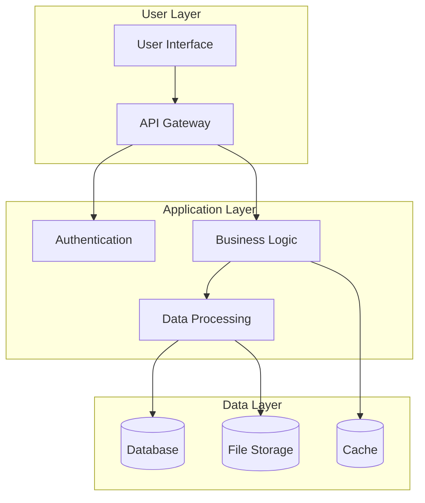
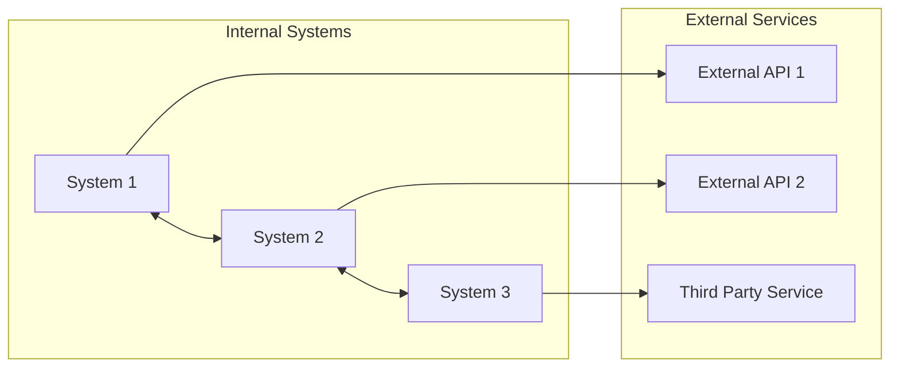

# System Documentation - Table of Contents

## Overview
This document serves as the central navigation hub for all system documentation. It provides a structured overview of the system organized by Domain → Feature → Function hierarchy.

## Documentation Structure

### Quick Reference
- **System Templates**: Use [`System-Documentation-Template.md`](System-Documentation-Template.md) for new system docs
- **Mermaid Charts**: All diagrams use Mermaid syntax for AI compatibility
- **Updates**: Keep this overview current when adding new documentation

## System Domains

### Domain: [Primary Domain Name]
**Location**: [`/docs/System/[domain-name]/`](./domain-name/)
**Purpose**: Brief description of what this domain handles

#### Features:
- **[Feature 1]**: [`feature-1.md`](./domain-name/feature-1.md)
  - Function: Specific capability 1
  - Function: Specific capability 2
- **[Feature 2]**: [`feature-2.md`](./domain-name/feature-2.md)
  - Function: Specific capability 1
  - Function: Specific capability 2

### Domain: [Secondary Domain Name]
**Location**: [`/docs/System/[domain-name-2]/`](./domain-name-2/)
**Purpose**: Brief description of what this domain handles

#### Features:
- **[Feature 1]**: [`feature-1.md`](./domain-name-2/feature-1.md)
  - Function: Specific capability 1
  - Function: Specific capability 2

## System Architecture

### High-Level Architecture

### Integration Overview

## Documentation Guidelines

### For AI Context
When working with AI tools, include relevant sections based on the task:
- **Overview**: Always include for system context
- **Specific Domain/Feature**: Include only relevant sections to manage context window
- **Architecture**: Include when making structural changes
- **Integration**: Include when working with external systems

### For Developers
- Start with Overview for general understanding
- Navigate to specific Domain/Feature for detailed implementation
- Reference Architecture for system design decisions
- Check Integration docs for external dependencies

## Cross-System Dependencies

### Internal Dependencies
| System | Dependency Type | Documentation |
|--------|----------------|---------------|
| [System A] | Data Provider | [`system-a.md`](./system-a.md) |
| [System B] | Service Consumer | [`system-b.md`](./system-b.md) |

### External Dependencies
| Service | Purpose | Documentation |
|---------|---------|---------------|
| [External API] | Data Source | [`external-api-integration.md`](./integrations/external-api.md) |
| [Third Party] | Processing | [`third-party-service.md`](./integrations/third-party.md) |

## Maintenance Notes

### Regular Updates Required
- [ ] Architecture diagrams when system changes
- [ ] Integration documentation when APIs change
- [ ] Feature documentation when functionality changes
- [ ] This overview when new domains/features are added

### Review Schedule
- **Monthly**: Review for accuracy and completeness
- **After Major Releases**: Update architecture and integration docs
- **When Onboarding**: Verify documentation is current and helpful

## Quick Navigation

### By Development Phase
- **Planning**: Start with [Architecture](#system-architecture)
- **Development**: Focus on specific [Domain documentation](#system-domains)
- **Integration**: Review [Dependencies](#cross-system-dependencies)
- **Maintenance**: Check [Maintenance Notes](#maintenance-notes)

### By Role
- **Developers**: Domain-specific documentation
- **Architects**: System architecture and integration docs
- **DevOps**: Integration and maintenance documentation
- **AI Tools**: Overview + specific domain as needed

---
*This overview should be the first document referenced when working on system-related tasks.*